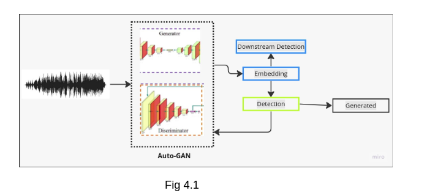
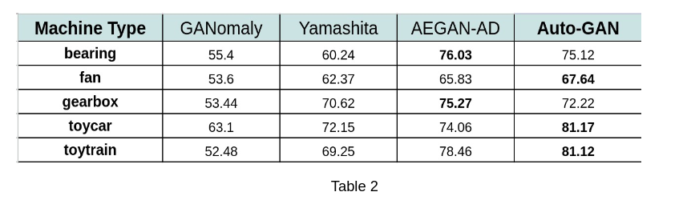
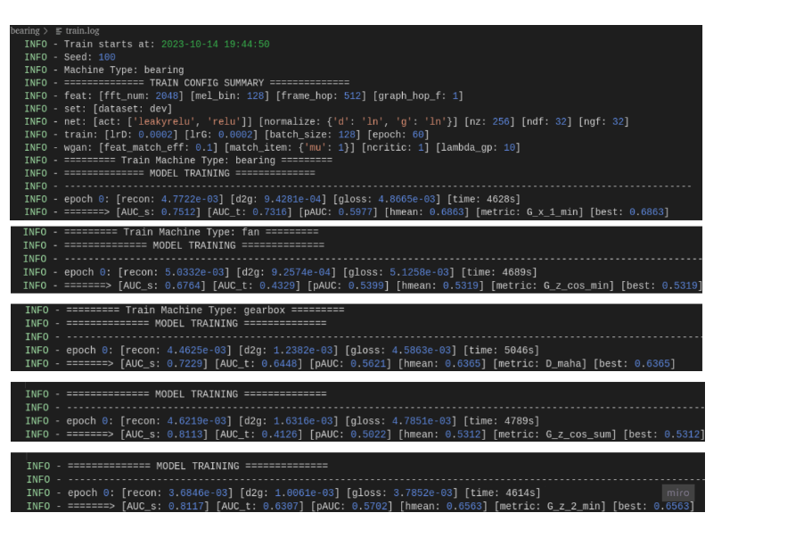

# Detecting-Machine-Anomalies-An-Unsupervised-Auto-GAN-Framework


## Anomaly Detection Framework




## Anomaly Detection Benchmarking




## Proof


## To run 

```
python train.py --mt fan -c 0 --seed 100

```

